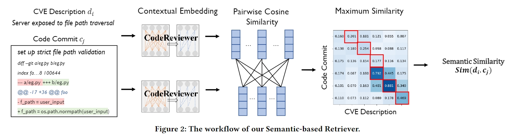

# Semantic-based Retriever for Security Patch Tracing

PatchFinder's Semantic-based Retriever is an innovative component designed specifically for linking CVE descriptions with their corresponding patches in code repositories. It stands as a key feature in the PatchFinder tool, enhancing the accuracy and efficiency of security patch tracing in open-source software.

## Core Functionality
- **Semantic Analysis**: Utilizes context embedding to understand and match the semantics between CVE descriptions and code changes.
- **Integration with CodeReviewer**: Employs a pretrained CodeReviewer model to deeply analyze code semantics, ensuring precise patch identification.


For an illustration, BERTScore recall can be computed as



## Usage

### Installation
* Python version >= 3.6
* PyTorch version >= 1.0.0

There are two ways to use the Semantic-based Retriever:

#### Install it from this source:
```sh
pip install .
```
and you can use it as a python module.

#### Using Python Function:

On a high level, we provide a python function `cr_score.score`. 
Please refer to [`cr_score/score.py`](./bert_score/score.py) for implementation details.


#### Command Line Interface (CLI)
We provide a command line interface (CLI) of BERTScore as well as a python module. 
For the CLI, you can use it as follows:
1. To evaluate the semantic similarity between two text files:

```sh
cr-score -r example/refs.txt -c example/hyps.txt -m microsoft/codereviewer
```

See more options by `cr-score -h`.


2. To visualize matching scores:
```sh
cr-score-show -m microsoft/codereviewer -r "Server exposed to file path traversal" -c "set up strict file path validation" -f out.png
```
The figure will be saved to out.png.


#### Practical Tips

* Using inverse document frequency (idf) on the reference
  sentences to weigh word importance  may correlate better with human judgment.
  However, when the set of reference sentences become too small, the idf score 
  would become inaccurate/invalid.
  We now make it optional. To use idf,
  please set `--idf` when using the CLI tool or
  `idf=True` when calling `cr_score.score` function.
* When you are low on GPU memory, consider setting `batch_size` when calling
  `cr_score.score` function.
* To use a particular model please set `-m MODEL_TYPE` when using the CLI tool
  or `model_type=MODEL_TYPE` when calling `cr_score.score` function. 
* We tune layer to use based on WMT16 metric evaluation dataset. You may use a
  different layer by setting `-l LAYER` or `num_layers=LAYER`. To tune the best layer for your custom model, please follow the instructions in [tune_layers](tune_layers) folder.
* __Limitation__: Because CodeReviewer with learned positional embeddings are pre-trained on sentences with max length 512, Our Semantic-based retriever is undefined between sentences longer than 510 (512 after adding \[CLS\] and \[SEP\] tokens). The sentences longer than this will be truncated. 


### Acknowledgements

This repo wouldn't be possible without the awesome [BertScore](https://github.com/Tiiiger/cr_score), [CodeReviewer](https://huggingface.co/microsoft/codereviewer), [fairseq](https://github.com/pytorch/fairseq), and [transformers](https://github.com/huggingface/transformers).


